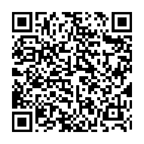

<div align="center">

# SignMedia: Cryptographically Verifiable Media Codec & Provenance Container

<h2>Donations</h2>
<p>
  
</p>
<p><strong>XMR:</strong></p>
<p>
  <sub>87wqyoRwNdJaCpR9gvXwuQaBYAJtuytEw9NV8Rz2j31AJfhqkjxSSkogRLgB7zKcoDbwE2MAY9MdNZKNQRWmkNRJPNz2qXD</sub>
</p>
</div>


## Overview

**SignMedia** is a next-generation media container and provenance
system designed for long-term digital media authenticity.
It is **not a real-time codec**, but a **digital preservation,
attribution, and derivative‑tracking format** designed to ensure that:

-   Every media file can be cryptographically proven to originate from a
    specific author.
-   Any clipped or remixed version can still be cryptographically tied
    to the original.
-   The lineage of edits forms an unbroken, verifiable **chain of
    signatures**, allowing attribution even for small segments.
-   Existing codecs (H.264/AV1, AAC/Opus, etc.) can operate inside the
    SignMedia container.

SignMedia provides a **trustable, verifiable, future‑proof format for
digital evidence, archival footage, research media, journalism assets,
and long-term cultural preservation**.

------------------------------------------------------------------------

## Core Features

### ✔ Original Work Digital Signatures

Each stored media asset contains an **Original Work Descriptor (OWD)**:

-   Title, author identity, creation timestamp
-   Codec and track metadata
-   A Merkle-tree root hash for each track
-   A cryptographic signature (Ed25519 by default)

This signature guarantees the authenticity and integrity of the original
media.

------------------------------------------------------------------------

### ✔ Derivative/Clip Provenance (Chained Signatures)

Derived works embed a **Derivative Work Descriptor (DWD)**:

-   Reference to original work ID
-   Chunk-range mapping (which portions were used)
-   Merkle proofs showing those chunks exist in the original
-   Optional additional creator signature for the editor or clipper
-   New Merkle-root hash for the derived content

This supports a cryptographically traceable edit lineage:

    Original Author → Work A
                           ↳ Editor 1 → Clip A1
                                     ↳ Editor 2 → Clip A1.1

Any viewer can validate the full ancestry.

------------------------------------------------------------------------

### ✔ Codec-Agnostic Compression Layer

SignMedia does **not** define new audio/video transforms.
Instead, it supports:

-   H.264 / H.265 / AV1
-   VP9\
-   AAC / Opus / FLAC / PCM
-   (Optional) Custom experimental codecs

The provenance system treats the media payloads as opaque binary chunks.

------------------------------------------------------------------------

### ✔ Cryptographic Chunking & Merkle Trees

Every media file is chunked (default: 1-second GOP/audio slices), then
hashed.
Hashes become the leaves of a Merkle tree, enabling:

-   Segment-level integrity checks
-   Fast attribution for clips (verify only the referenced chunks)
-   Extremely compact proofs stored inside the DWD

This allows clips to remain lightweight while retaining cryptographic
traceability.

------------------------------------------------------------------------

### ✔ Simple, Modern Container Format

SignMedia introduces a `.smed` container with:

-   A binary header
-   Track table
-   Media payload chunks
-   OWD / DWD metadata blocks
-   Signature blocks
-   Optional embedded key/cert bundles

Decoders can extract embedded bitstreams and pipe them to standard
decoders like FFmpeg.

------------------------------------------------------------------------

## Architecture

SignMedia is structured into **three layers**:

### 1. Essence Layer (Existing Codecs)

Stores raw compressed bytes: - `VTRACK0`: H.264 bitstream
- `ATRACK0`: Opus bitstream

These bytes are chunked but not modified.

------------------------------------------------------------------------

### 2. Provenance Layer

Handles hashing, signatures, identity, and mapping.

Key concepts: - **Chunk** --- uniform block of video/audio bytes
- **Hash** --- SHA-256 or BLAKE3
- **Merkle Tree** --- one per trac
- **OWD** --- Original Work Descriptor
- **DWD** --- Derivative Work Descriptor
- **Signatures** --- Ed25519

------------------------------------------------------------------------

### 3. Container Layer

Defines: - Header structures
- Track metadata
- Embedded manifests
- Navigation tables
- Payload alignment

------------------------------------------------------------------------

SignMedia CLI tool

Usage: signmedia <COMMAND>

Commands:
  gen-key  Generate a new Ed25519 keypair
  sign     Sign a media file and create a .smed container
  verify   Verify a .smed file
  clip     Create a clip from a .smed file
  help     Print this message or the help of the given subcommand(s)

Options:
  -h, --help  Print help

SignMedia includes these CLI utilities:

## CLI usage

Build the CLI:

```bash
cargo build --release
```

Generate a keypair (private key file + prints public key):

```bash
cargo run -- gen-key --output key.priv
```

Sign a file and create a `.smed` container:

```bash

------------------------------------------------------------------------

## Example Workflow

### Create a signed original

    sign input.mp4     --author-key private.ed25519     --output original.smed

### Verify original

    verify original.smed

### Create a clip (00:10 - 00:25)

    clip original.smed     --start 10 --end 25     --editor-key editor.key     --output clip.smed

------------------------------------------------------------------------

## File Format Specification (High-Level)

    +-------------------------------------------------------+
    | SignMedia Header                                     |
    +-------------------------------------------------------+
    | Track Table                                           |
    +-------------------------------------------------------+
    | Chunk Table                                           |
    +-------------------------------------------------------+
    | Media Payload                                         |
    +-------------------------------------------------------+
    | Provenance Section (OWD / DWD)                        |
    +-------------------------------------------------------+
    | Signature Blocks                                      |
    +-------------------------------------------------------+

### OWD Example (CBOR/JSON)

``` json
{
  "version": 1,
  "work_id": "6abd...91fe",
  "author_pubkey": "ed25519:8fbb...",
  "created_utc": "2026-01-01T12:00:00Z",
  "tracks": [
    {
      "id": 0,
      "type": "video",
      "codec": "H264",
      "merkle_root": "abcd..."
    }
  ]
}
```

------------------------------------------------------------------------

## Security Model

SignMedia defends against:

-   Bitstream tampering
-   Metadata tampering
-   Clip forgery
-   Deepfake misattribution
-   Cropped/trimmed media being presented as unrelated content

Threat model includes:

-   Malicious editors
-   Man-in-the-middle distributors
-   Long-term archival corruption
-   Watermark-stripping attempts

------------------------------------------------------------------------

## Implementation Notes

-   Written in **Rust** for safety and performance
-   Uses **Ed25519** for signatures
-   Uses **BLAKE3** for Merkle leaves
-   Uses **CBOR** for compact metadata
-   Supports streaming verification for very large media files
-   Compatible with FFmpeg for decoding

------------------------------------------------------------------------

## Roadmap

### v1.0

-   Original signing
-   Clip provenance
-   SMED container
-   Rust-based reference decoder
-   CLI tools

### v1.5

-   Streaming verification API
-   Multi-track support (subtitles, metadata, multi-angle video)
-   Optional watermarking layer

### v2.0

-   Extended provenance graph (collabs, remixes, overlays)
-   Hardware-backed signature verification (TPM/TEE)
-   Zero-knowledge clip proofs (experimental)

------------------------------------------------------------------------

## Why SignMedia Matters

Digital media manipulation is accelerating.
SignMedia is built to ensure:

-   **Artists get credit.**
-   **Journalism stays verifiable.**
-   **Court evidence remains uncompromised.**
-   **Historical records remain immutable.**
-   **Clips & remixes preserve lineage.**

It's a codec+container for the authenticity-first era.

------------------------------------------------------------------------

For documentation, API references, and examples, see the `/docs`
directory in this repository.
